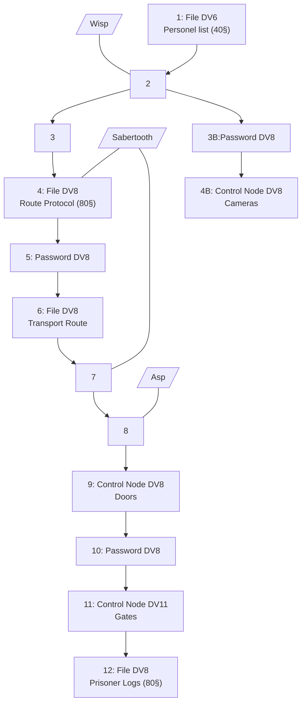

---
tags:
  - Location
type: Hideout
parent:
  - "[[Black Moonlight]]"
cssclasses:
  - cards
  - cards-1-1
---
# Characteristics
[[Checkpoint Wernar]] is an [[Eldar]] owned checkpoint where data is stored and meetings happen. It stores Combi-style SUV's in the back.

## Layout
![[Checkpoint_Wernar.png]]

There's a reception area where 2 [[Scum]] guards the deeper entrance and have a basic camera terminal to observe the entrances. Once the alarms are rung, 8 [[Novice]] guards will pour in from the back and call for support which will arrive in 30s (10 rounds).

Taking a minute, the transport documents can also directly be downloaded from the server room in the east.
The staff entrance, gate and entrance to the back are locked and require an id card to open. In the back armored SUVs are stored.
## Net Architecture

### Black ICE
![[Wisp]]
![[Sabertooth]]
![[Asp]]